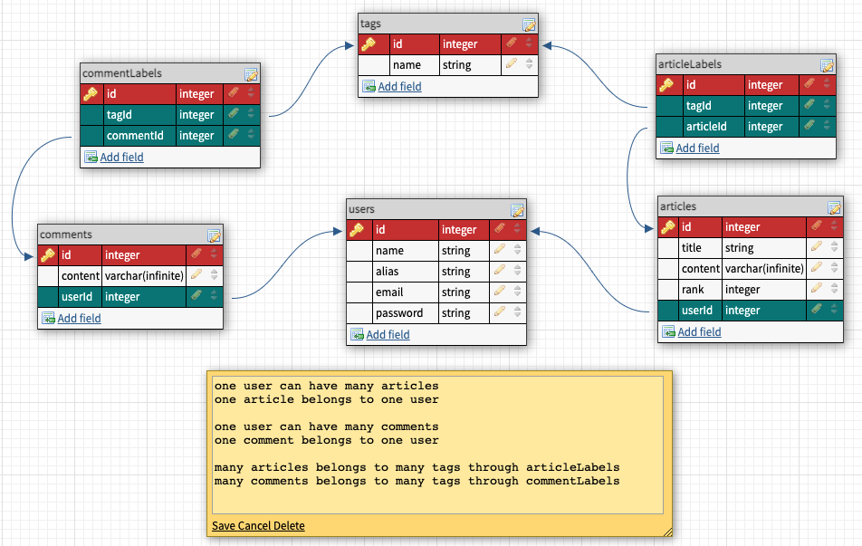
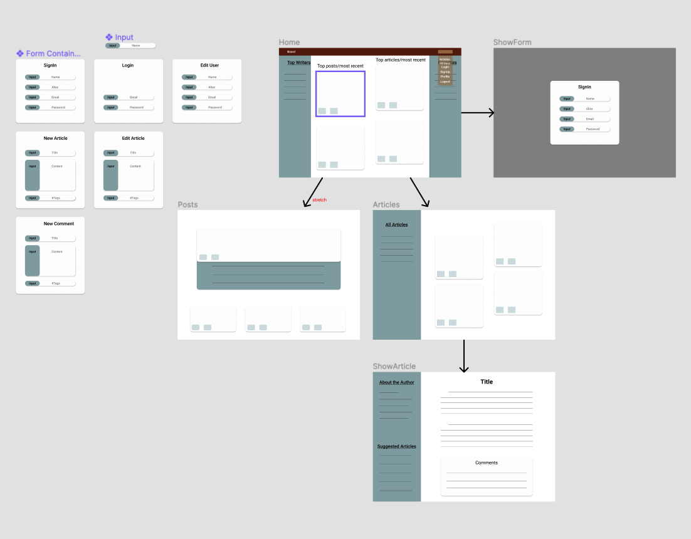

# Blog-FE

## OVERVIEW
This is a personal blog for users to create content to share with other users. Users can create content, read articles, follow authors and tags. 
## USER STORIES
1. A user can create/update/delete an account. All Visitors
2. The Home page shows top/most recent articles, side bar content. All Visitors
3. The Articles page shows all articles, side bar content. Articles can be clicked to nav to the ShowArticle page. There is a Back Btn and a Create Article Btn. All Visitors
    1.  Each article can be saved and/or up-voted. A user can create/edit/delete an article. Users Only
4. The ShowArticle page shows the full article, article comments, side bar content. All Visitors
    1. The article can be saved, up-voted, commented on. Users Only 
## ERD & WIREFRAMES

 

## ROUTES
### BACKEND ROUTES
- POST /users/new
- GET /users/verify
- PUT /users/update
- DELETE /users/delete

- POST /articles/new
- GET /articles
- GET /articles/:articleId
- PUT /articles/:articleId
- DELETE /articles/:articleId

- POST /comments/new
- GET /comments
- GET /comments/:commentId
- DELETE /comments/:commentId
### URL ROUTES
- /
- /home
- /articles
- /articles/:articleId
- /shadow
## COMPONENT TREE
- views
    - Home
    - Articles
    - ShowArticle
    - ShowForm
- partials
    - NavBar
    - SideBar
    - MessageBar
- components
    - UserForm
    - ArticleForm
    - CommentForm
    - ArticleCard
    - CommentCard

## MVP
- [] User Auth
    - [x] Login
    - [x] Signup
    - [x] Logout
    - [x] Edit user info 
        -[] (Owner only)
    - [x] Delete user 
        -[] (Owner only)
    - [x] Encrypted id
        - [x] saved to localStorage
        - [x] saved to global state
    - [] Hashed passwords
- [] Articles
    - [x] Get all
        - [] Get articles filtered by tags
    - [x] Get one
    - [x] Create article 
        - [] (User only)
    - [x] Edit article 
        - [] (Owner only)
    - [x] Delete article 
        - [] (Owner only)
    - [] Articles can be saved
    - [] Articles can be up-voted
- [] Comments
    - [] Create comment on article 
        - [] (Users only)
        - [] Comment belongs to one user and one article
    - [] Remove comment on article 
        -[] (User & Owner only)
- [] Tags
    - [] Seed default tags
    - [] Add to articles
    - [] Remove from articles
    - [] Add to comments
    - [] Remove from comments

## STRETCH
- [] Add user img column
- [] Add article img column
- [] Animations using react-spring
- [] Global error handler